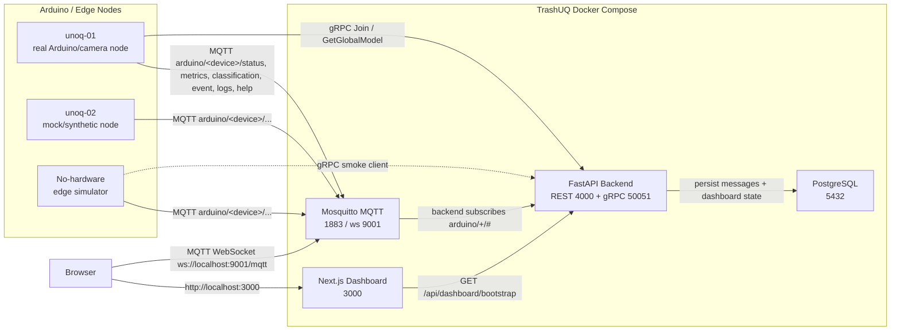
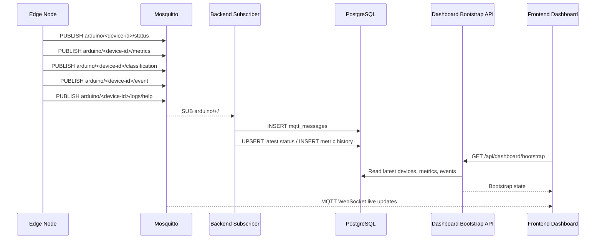
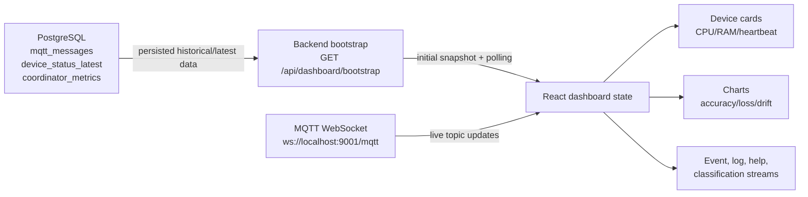
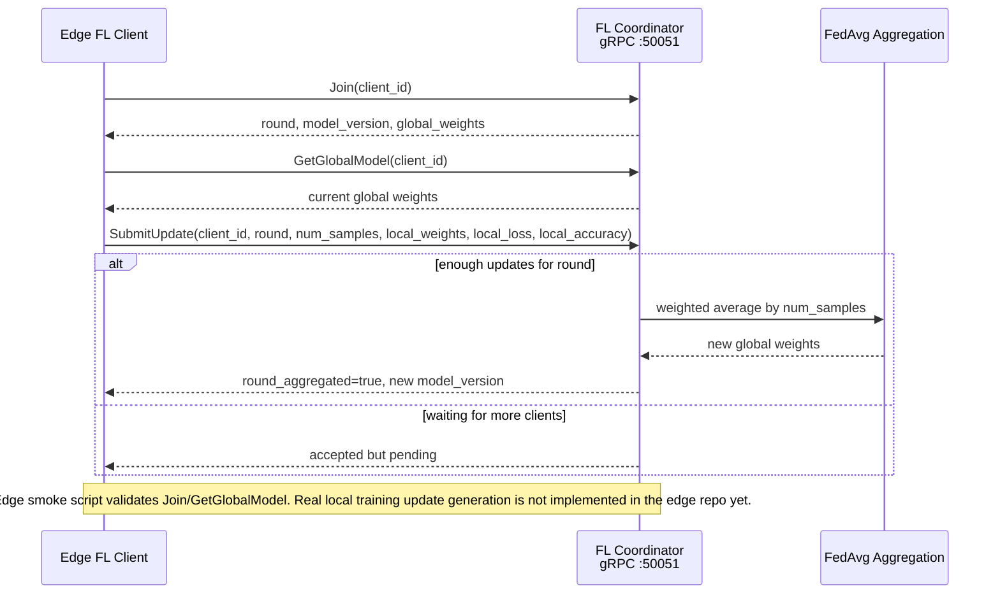
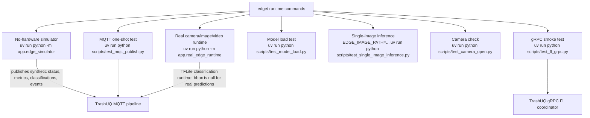
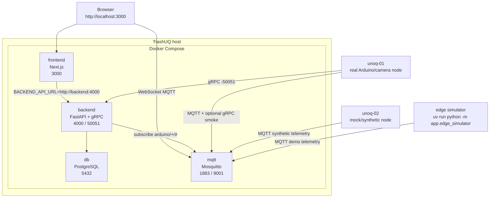

# TrashUQ

**Edge AI + Federated Learning platform for real-time trash classification monitoring**


TrashUQ is a complete edge-to-cloud platform for monitoring trash classification devices. Edge and Arduino nodes publish telemetry, runtime metrics, classifications, events, logs, and help requests over MQTT. The backend persists those messages in PostgreSQL, exposes dashboard state through a REST bootstrap API, and hosts a gRPC Federated Learning coordinator. The Next.js dashboard combines persisted state with live MQTT WebSocket updates so devices, classifications, metrics, event streams, and FL-related charts update in real time.

This README describes the project as one unified platform. The code is temporarily split into `TrashUQ/` and `edge/`, but these parts are intended to be merged.

## Why TrashUQ?

Urban waste monitoring is a good edge AI problem: camera nodes need fast local inference, the dashboard needs live operational visibility, and model improvement should not require centralizing every raw image. TrashUQ demonstrates that full path:

- real-time multi-device telemetry over MQTT,
- persisted backend state in PostgreSQL,
- an operational dashboard for devices, classifications, events, and FL metrics,
- a no-hardware simulator for reproducible demos,
- a real camera/model runtime prepared for Arduino/edge execution,
- gRPC contracts for Federated Learning coordination,
- simulation evidence for FL behavior at 2, 5, 10, and 20 clients.

## Current Capability Map

| Area | Status | Evidence in repo |
| --- | --- | --- |
| MQTT ingestion | Implemented and verified | `backend/app/mqtt_runtime.py`, `backend/app/service.py`, `edge/app/mqtt_client.py` |
| PostgreSQL persistence | Implemented | `backend/app/db.py`, `mqtt_messages`, `device_status_latest`, `coordinator_metrics` |
| Dashboard bootstrap API | Implemented | `GET /api/dashboard/bootstrap` in `backend/app/main.py` |
| Live browser updates | Implemented | `frontend/lib/mqtt.ts`, WebSocket broker on `9001` |
| gRPC FL coordinator | Implemented | `backend/app/fl.proto`, `backend/app/fl_coordinator.py`, `backend/app/grpc_server.py` |
| Edge simulator | Implemented | `edge/app/edge_simulator.py` |
| Real model runtime | Implemented for classification | `edge/app/model_runner.py`, `edge/app/real_edge_runtime.py`, `edge/models/trash_classifier.tflite` |
| Object detection | Not implemented | real runtime returns classification with `bbox: null` |
| Real local FL training on edge | Not implemented yet | `scripts/test_fl_grpc.py` skips `SubmitUpdate` intentionally |
| FL at scale | Simulation-based | `experiments/part_b/run_part_b.py`, `artifacts/part_b/latest/` |

## Key Features

- Real-time MQTT telemetry ingestion from edge devices.
- Multi-device dashboard with online status, CPU/RAM, heartbeat, mode, latest classification, and confidence.
- PostgreSQL persistence for raw MQTT messages, latest device status, device status history, and coordinator metrics.
- Live event, log, help, and classification streams.
- gRPC Federated Learning coordinator with `Join`, `GetGlobalModel`, and `SubmitUpdate`.
- No-hardware simulator that publishes real MQTT traffic through the real backend/database/dashboard pipeline.
- Real camera/image/video runtime using a TensorFlow Lite classification model.
- Verification scripts for MQTT, gRPC, model loading, single-image inference, and camera access.
- FL simulation at scale using FedAvg under non-IID data partitions.

## System Architecture



Diagram sources live in `docs/assets/readme/diagrams/`.

## Repository Layout

```text
TrashNet/
  TrashUQ/                         # server, dashboard, backend, MQTT, DB, FL coordinator
    compose.yaml                   # db, mqtt, backend, frontend
    backend/app/main.py            # FastAPI routes and startup
    backend/app/mqtt_runtime.py    # MQTT subscriber, arduino/+/# ingest
    backend/app/service.py         # normalization, persistence reads, dashboard bootstrap
    backend/app/db.py              # PostgreSQL schema
    backend/app/fl.proto           # FL gRPC contract
    backend/app/fl_coordinator.py  # in-memory weighted aggregation coordinator
    frontend/app/page.tsx          # dashboard UI
    frontend/lib/mqtt.ts           # browser MQTT WebSocket client
    mqtt/mosquitto.conf            # MQTT + WebSocket listeners
    experiments/part_b/            # FL simulation runner
    artifacts/part_b/latest/       # generated Part B metrics and figures
    docs/assets/readme/            # README screenshots and diagrams
  edge/                            # edge client, simulator, model runtime, MQTT/gRPC client
    app/config.py                  # edge environment configuration
    app/mqtt_client.py             # MQTT publisher contract
    app/edge_simulator.py          # no-hardware live demo
    app/fl_client.py               # gRPC smoke client
    app/model_runner.py            # TFLite classification wrapper
    app/camera_runtime.py          # camera/image/video frame source
    app/real_edge_runtime.py       # real runtime loop
    scripts/                       # verification scripts
    models/trash_classifier.tflite # TFLite classifier
```

## Services and Ports

| Service | Role | Port |
| --- | --- | --- |
| Frontend | Dashboard UI | `3000` |
| Backend API | REST API / bootstrap | `4000` |
| gRPC FL | Federated Learning coordinator | `50051` |
| PostgreSQL | Persistence | `5432` |
| MQTT | Broker | `1883` |
| MQTT WebSocket | Browser live updates | `9001` |

## Quick Start

```sh
cd TrashUQ
cp backend/.env.example backend/.env
docker compose up --build
```

If `backend/.env` already exists, keep it unless you intentionally want to reset local settings. Do not commit `.env`.

Verify the backend:

```sh
curl http://localhost:4000/health
curl http://localhost:4000/api/dashboard/bootstrap
curl http://localhost:4000/api/fl/state
```

Open the dashboard:

```text
http://localhost:3000
```

## Demo in 3 Terminals

Terminal 1: server

```sh
cd TrashUQ
docker compose up --build
```

Terminal 2: edge simulator

```sh
cd edge
uv run python -m app.edge_simulator
```

Terminal 3: MQTT monitor

```sh
cd TrashUQ
docker compose exec mqtt mosquitto_sub -h localhost -p 1883 -t 'arduino/+/+' -v
```

Browser:

```text
http://localhost:3000
```

Expected result:

- `unoq-01` appears online.
- CPU, RAM, heartbeat, mode, and latest classification update.
- Metrics update and charts populate from MQTT metric history.
- Event/log/help/classification streams update from real MQTT messages.
- Backend persists all MQTT messages into PostgreSQL.

## Edge Modes

| Mode | Command | Hardware required | Purpose |
| --- | --- | --- | --- |
| MQTT one-shot test | `uv run python scripts/test_mqtt_publish.py` | No | Validate all MQTT topics and payload shapes |
| Simulator | `uv run python -m app.edge_simulator` | No | Live dashboard demo through the real pipeline |
| gRPC smoke | `uv run python scripts/test_fl_grpc.py` | No | Validate `Join` and `GetGlobalModel` against the FL coordinator |
| Model load | `uv run python scripts/test_model_load.py` | Model deps | Validate TFLite interpreter/model loading |
| Single-image inference | `EDGE_IMAGE_PATH=/path/to/image.jpg uv run python scripts/test_single_image_inference.py` | Image file + model deps | Validate classification on one image |
| Camera open | `uv run python scripts/test_camera_open.py` | Camera | Validate OpenCV camera access |
| Real runtime | `uv run python -m app.real_edge_runtime` | Camera, image, or video source | Publish real model/runtime telemetry to TrashUQ |

Useful edge environment variables:

```sh
DEVICE_ID=unoq-01
MQTT_HOST=localhost
MQTT_PORT=1883
MQTT_TOPIC_ROOT=arduino
FL_GRPC_HOST=localhost
FL_GRPC_PORT=50051
EDGE_INPUT_SOURCE=camera        # camera, image, or video
EDGE_CAMERA_INDEX=0
EDGE_IMAGE_PATH=
EDGE_VIDEO_PATH=
EDGE_MODEL_PATH=models/trash_classifier.tflite
EDGE_LABELS=cardboard,glass,paper,plastic
```

## MQTT Contract

Topic root: `arduino`

The backend subscribes to:

```text
arduino/+/#
```

The frontend subscribes to:

```text
arduino/<device-id>/status
arduino/<device-id>/metrics
arduino/<device-id>/classification
arduino/<device-id>/event
arduino/<device-id>/logs
arduino/<device-id>/help
```

Status payload example:

```json
{
  "device_id": "unoq-01",
  "online": true,
  "status": "Online",
  "state": "simulation",
  "mode": "simulation",
  "cpu": 52.1,
  "ram": 41.7,
  "heartbeat": "42 ms",
  "model_version": "simulated-v1",
  "ts": "2026-05-17T10:09:44Z"
}
```

Metrics payload example:

```json
{
  "device_id": "unoq-01",
  "round": 1,
  "localLoss": 0.42,
  "localAccuracy": 89.6,
  "globalLoss": 0.32,
  "globalAccuracy": 91.2,
  "samplesTrained": 128,
  "fps": 12.4,
  "inference_ms": 83.0,
  "drift": 2.1,
  "cpu": 52.1,
  "ram": 41.7,
  "ts": "2026-05-17T10:09:44Z"
}
```

Classification payload example:

```json
{
  "device_id": "unoq-01",
  "label": "plastic",
  "confidence": 0.91,
  "bbox": null,
  "model_version": "trash_classifier.tflite",
  "inference_ms": 83.0,
  "ts": "2026-05-17T10:09:44Z"
}
```

The real model runtime is classification-only and publishes `bbox: null`. The simulator and one-shot MQTT test may publish synthetic bounding-box values for dashboard contract testing; that does not mean object detection is implemented.

## MQTT Pipeline



## Backend API

| Endpoint | Purpose |
| --- | --- |
| `GET /health` | Backend health check, returns `{"ok": true}` |
| `GET /api/dashboard/bootstrap` | Initial/polled dashboard state: devices, metrics, FL snapshot, events, logs, classifications, help requests |
| `GET /api/fl/state` | Current in-memory FL coordinator state |

The frontend exposes a proxy route at `/api/[...path]`, so this also works through the dashboard container:

```sh
curl http://localhost:3000/api/dashboard/bootstrap
```

## Dashboard

The dashboard is implemented in `frontend/app/page.tsx` and shows:

- active and online devices,
- live client summary,
- CPU/RAM and last heartbeat,
- latest classification and confidence,
- classification stream,
- event/log/help stream,
- global accuracy and global loss,
- local training loss,
- client drift,
- FL coordinator state such as current round, model version, pending updates, and minimum clients per round.

Additional screenshot capture notes are in `docs/assets/readme/screenshots/README.md`.

## Dashboard Data Flow



## Federated Learning

The backend starts a gRPC FL coordinator on port `50051`. The contract is defined in `backend/app/fl.proto` and mirrored in the edge repo under `app/fl.proto`.

RPC methods:

- `Join(client_id)`: registers a client and returns the current round, model version, and global weight vector.
- `GetGlobalModel(client_id)`: returns the current global model metadata and weights.
- `SubmitUpdate(client_id, round, num_samples, local_weights, local_loss, local_accuracy)`: accepts a local update and aggregates when at least `FL_MIN_CLIENTS_PER_ROUND` updates are pending.

Current implementation status:

- Backend aggregation is implemented in memory with weighted averaging by `num_samples`.
- The edge smoke client verifies `Join` and `GetGlobalModel`.
- The edge repo does not yet implement real local FL training/update generation; `scripts/test_fl_grpc.py` explicitly skips `SubmitUpdate`.
- Part B large-scale FL evidence is simulation-based, not a live hardware FL run.



## Real Arduino / Camera Mode

Part A validates a mixed deployment concept using:

- `unoq-01`: real Arduino/camera node,
- `unoq-02`: mock/synthetic node.

The real runtime path in `edge/app/real_edge_runtime.py`:

1. loads `models/trash_classifier.tflite`,
2. reads frames from OpenCV camera, image, or video source through `app/camera_runtime.py`,
3. runs TFLite classification through `app/model_runner.py` and `bin_mpu/classifier.py`,
4. publishes status, metrics, classifications, logs, and events through the same MQTT contract,
5. optionally performs an FL coordinator smoke check using `Join` and `GetGlobalModel`.

Confirmed model/runtime facts:

- model file: `edge/models/trash_classifier.tflite`,
- task type: classification,
- default labels: `cardboard`, `glass`, `paper`, `plastic`,
- real predictions publish `bbox: null`,
- runtime depends on OpenCV plus either `tflite-runtime` on hardware or TensorFlow Lite support on a compatible development machine.

## Edge Runtime Modes



## Deployment Topology



## Verification Commands

Server:

```sh
cd TrashUQ
docker compose ps
curl http://localhost:4000/health
curl http://localhost:4000/api/dashboard/bootstrap
curl http://localhost:4000/api/fl/state
curl http://localhost:3000/api/dashboard/bootstrap
docker compose exec mqtt mosquitto_sub -h localhost -p 1883 -t 'arduino/+/+' -v
```

Database persistence:

```sh
cd TrashUQ
docker compose exec db psql -U trashuq -d dashboard -c "select topic, payload, created_at from mqtt_messages order by created_at desc limit 20;"
```

If you copied the current `backend/.env.example`, use its configured credentials instead:

```sh
docker compose exec db psql -U federated -d dashboard -c "select topic, payload, created_at from mqtt_messages order by created_at desc limit 20;"
```

Edge:

```sh
cd edge
uv run python scripts/test_mqtt_publish.py
uv run python scripts/test_fl_grpc.py
uv run python scripts/test_model_load.py
uv run python -m app.edge_simulator
```

Real camera/image checks:

```sh
cd edge
uv run python scripts/test_camera_open.py
EDGE_INPUT_SOURCE=image EDGE_IMAGE_PATH=/path/to/image.jpg uv run python scripts/test_single_image_inference.py
uv run python -m app.real_edge_runtime
```

## Evaluation Summary

### Part A - Mixed Arduino Edge Deployment

Part A validates the deployed edge/server integration path with two nodes:

- `unoq-01`: real Arduino/camera node,
- `unoq-02`: mock/synthetic node.

This validates MQTT publication, backend subscription, PostgreSQL persistence, dashboard bootstrap/live updates, and FL coordinator connectivity. It is an integration validation, not evidence that real local FL training is complete on hardware.

### Part B - FL Simulation At Scale

Part B is simulation-based and lives in `experiments/part_b/run_part_b.py` with outputs in `artifacts/part_b/latest/`.

Confirmed setup from `artifacts/part_b/latest/metadata.json`:

- clients: `2`, `5`, `10`, `20`,
- seeds: `11`, `29`, `47`,
- rounds: `25`,
- local epochs: `2`,
- optimizer: `SGD`,
- non-IID partitioning: Dirichlet `alpha=0.3`,
- dataset source: synthetic TrashNet-style fallback,
- classes: `cardboard`, `glass`, `paper`, `plastic`.

Summary from `table_b2_convergence_summary.csv`:

| Clients | Final accuracy mean | Final loss mean | Notes |
| --- | ---: | ---: | --- |
| 2 | 93.75% | 0.2192 | Stable convergence under Dirichlet non-IID partitioning |
| 5 | 93.56% | 0.2004 | Stable convergence under Dirichlet non-IID partitioning |
| 10 | 93.37% | 0.2018 | Stable convergence under Dirichlet non-IID partitioning |
| 20 | 93.75% | 0.1933 | Stable convergence under Dirichlet non-IID partitioning |

Communication cost is simulated in Part B and grows with client count. `table_b3_efficiency_cost.csv` reports total messages increasing from `100` at 2 clients to `1000` at 20 clients, with combined sent/received traffic increasing from about `0.394 MB` to about `3.941 MB`.

## Troubleshooting

| Problem | Check |
| --- | --- |
| Docker image pull/build errors | Confirm Docker daemon access and registry/network availability, then rerun `docker compose up --build`. |
| Port `5432` already allocated | Stop the local PostgreSQL service or set `POSTGRES_PORT` before starting Compose. |
| Frontend cannot reach backend | Verify `docker compose ps`, `curl http://localhost:4000/health`, and `curl http://localhost:3000/api/dashboard/bootstrap`. |
| MQTT connection refused | Confirm `trashuq-mqtt` is running and ports `1883`/`9001` are published. |
| Dashboard does not show device | Run `uv run python scripts/test_mqtt_publish.py`, then inspect `curl http://localhost:4000/api/dashboard/bootstrap`. |
| DB query auth fails | Use credentials from the active `.env`; defaults are `trashuq`, current example uses `federated`. |
| TFLite runtime missing | Install `tflite-runtime` on the edge device or TensorFlow with Lite support on a compatible dev machine. |
| Camera not found | Run `uv run python scripts/test_camera_open.py` and adjust `EDGE_CAMERA_INDEX`. |
| gRPC unavailable | Confirm backend is running and `localhost:50051` is reachable, then run `uv run python scripts/test_fl_grpc.py`. |

## Roadmap

- Merge `TrashUQ/` and `edge/` into one repository.
- Improve real hardware deployment packaging and environment documentation.
- Add real local FL training/update generation on edge clients.
- Extend the model registry and model version tracking.
- Persist richer FL round/update history.
- Add authentication and production security controls.
- Add production deployment instructions.
- Measure real network cost over MQTT/gRPC instead of simulation-only communication cost.

## License / Authors

Developed as part of the TrashUQ Edge AI + Federated Learning project.

The current edge repository includes an Apache 2.0 license file. A top-level unified project license should be finalized when the repositories are merged.
