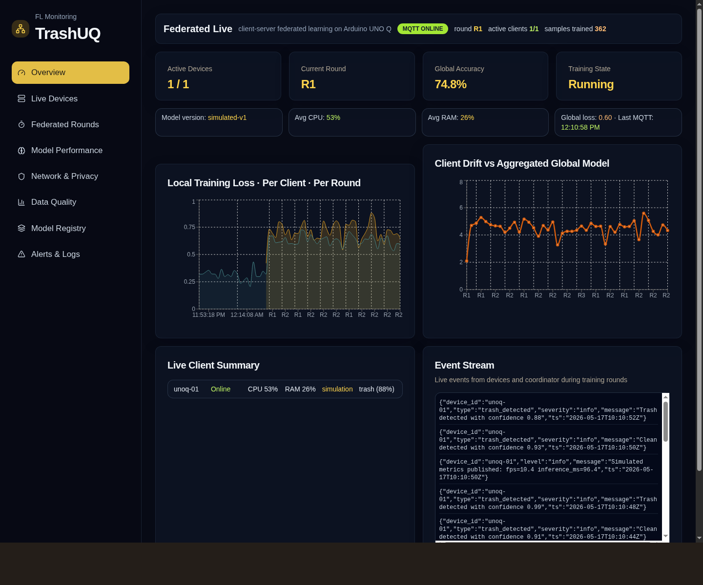
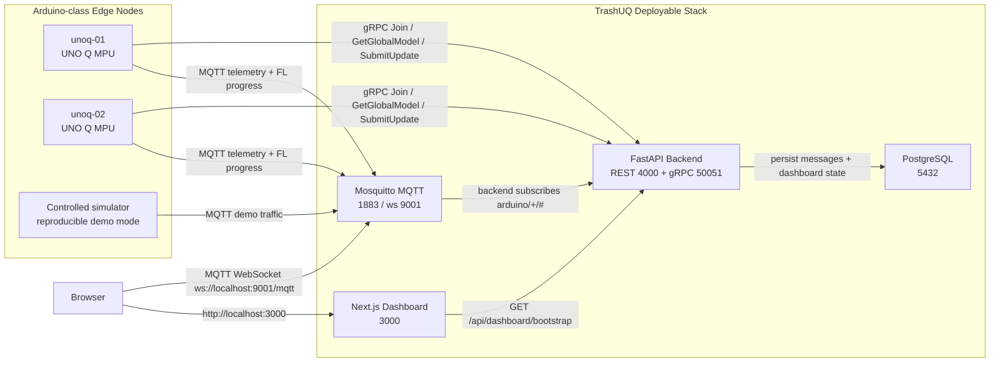
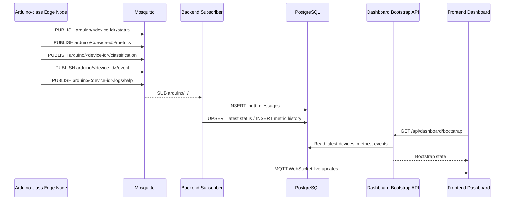
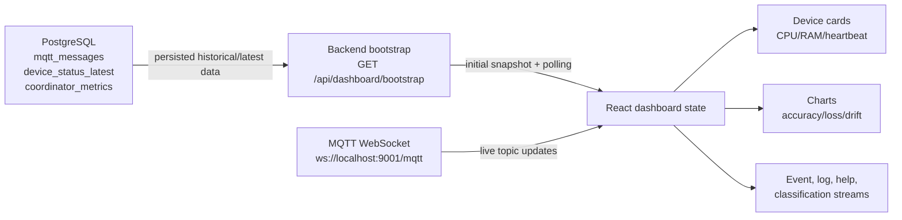
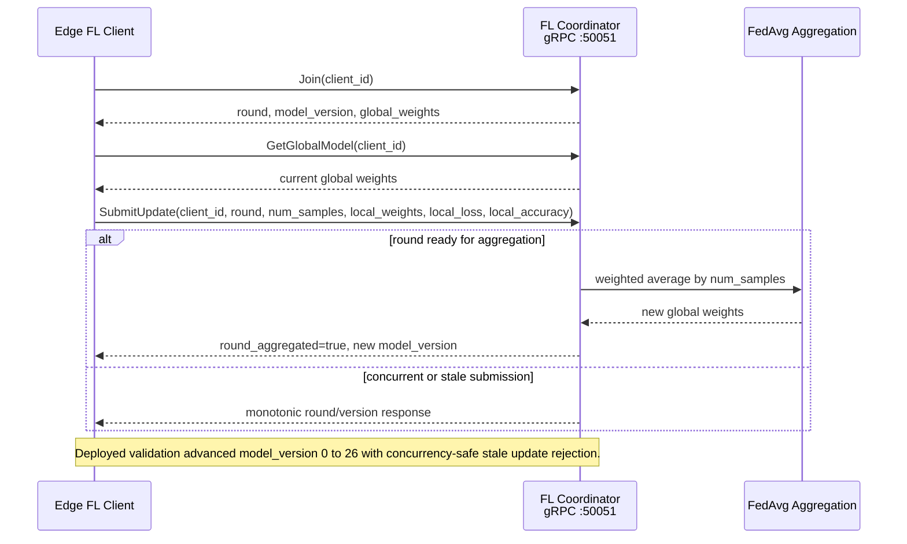
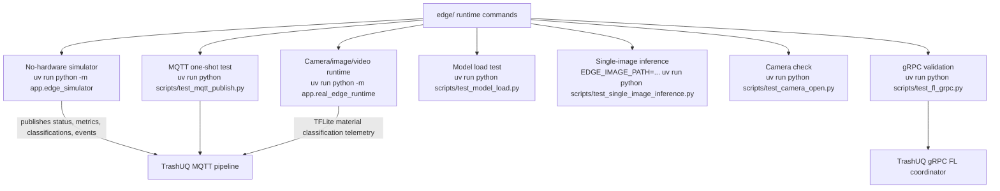
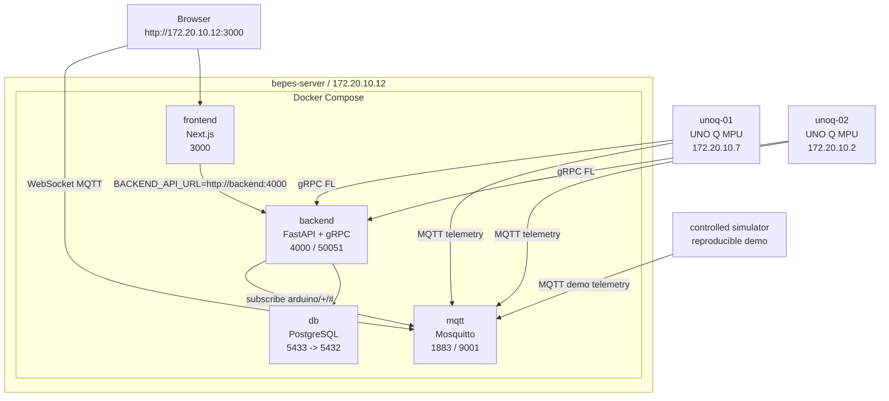

<p align="center">
  
</p>

<h1 align="center">TrashUQ</h1>

<p align="center">
  <strong>Edge AI + Federated Learning platform for real-time trash classification monitoring</strong>
</p>

<p align="center">
  <em>Arduino-class edge nodes, MQTT telemetry, PostgreSQL persistence, FastAPI, Next.js and gRPC FL coordination in one deployable research prototype.</em>
</p>

<p align="center">
  
  
  
  
  
  
  
  
</p>

<p align="center">
  <a href="#quick-start"><strong>Quick Start</strong></a>
  ·
  <a href="#validation-highlights"><strong>Validation</strong></a>
  ·
  <a href="#system-architecture"><strong>Architecture</strong></a>
  ·
  <a href="#federated-learning"><strong>Federated Learning</strong></a>
  ·
  <a href="#evaluation-summary"><strong>Evaluation</strong></a>
</p>

<p align="center">
  
</p>

<p align="center">
  <strong>Deployed validation:</strong> 2 Arduino-class UNO Q MPUs · 282 MQTT messages persisted · 26 FL rounds · model_version 0 to 26 · dashboard updates under 1 second
</p>

## Executive Summary

TrashUQ is an end-to-end Edge AI and Federated Learning platform for real-time trash classification monitoring. It connects Arduino-class edge nodes, MQTT telemetry, PostgreSQL persistence, a FastAPI backend, a live Next.js dashboard and a gRPC Federated Learning coordinator into a single deployable system.

The system has been validated as a multi-node edge-to-cloud prototype on `bepes-server` (`172.20.10.12`) with two UNO Q MPU clients. During the deployed run, TrashUQ persisted 282 MQTT messages with full JSON payload fidelity, displayed both edge clients live in the dashboard, executed 26 FL rounds, advanced the global model version monotonically from 0 to 26, and rejected stale concurrent updates correctly.

Part B extends the deployed validation with a controlled FedAvg scalability study across 2, 5, 10 and 20 clients under non-IID partitions. Final accuracy remained in the 93-94% range while communication cost scaled predictably with the number of participating clients.

This README presents TrashUQ as one unified platform. The code is currently organized across `TrashUQ/` and `edge/`, matching the final merged architecture used by the server, dashboard, MQTT, PostgreSQL, gRPC FL coordinator, simulator and edge runtime.

## Thesis-Grade Contributions

| Contribution | What TrashUQ demonstrates |
| --- | --- |
| End-to-end edge-to-cloud integration | Arduino-class clients publish MQTT telemetry into a persisted backend and live dashboard |
| Real-time observability | Device status, metrics, classifications, logs and FL charts update through REST bootstrap plus MQTT WebSocket streams |
| Federated Learning coordination | gRPC `Join`, `GetGlobalModel` and `SubmitUpdate` workflows with monotonic round/model-version tracking |
| Concurrency control | stale parallel updates are rejected correctly while the coordinator advances from `model_version` 0 to 26 |
| Edge AI runtime | TFLite trash material classification path for cardboard, glass, paper and plastic |
| Paper-ready evidence | deployed Arduino-class validation plus FedAvg scalability results with 2/5/10/20 clients |

## What Makes It Stand Out

- **A complete system, not a dashboard mockup:** edge clients, MQTT broker, backend subscriber, database schema, dashboard, gRPC coordinator and model runtime are wired together.
- **Deployed multi-node validation:** two UNO Q MPU devices published telemetry and participated in FL coordination against the same server stack.
- **Data integrity through the whole pipeline:** PostgreSQL persisted all MQTT messages with full topic and JSON payload fidelity.
- **Research-ready FL behavior:** 26 rounds, 25 successful aggregations, monotonic model-versioning and concurrency-safe stale update rejection.
- **Demo-ready reproducibility:** the no-hardware simulator publishes the same MQTT contract through the same backend, database and dashboard path.

## Current Capability Map

| Area | Status | Evidence |
| --- | --- | --- |
| Multi-node Arduino telemetry | Validated | `unoq-01` and `unoq-02` published 282 MQTT messages |
| Backend persistence | Validated | PostgreSQL stored status, metrics and event streams with topic/payload fidelity |
| Dashboard live monitoring | Validated | both devices visible online with live FL charts updated within 1 second |
| gRPC FL coordinator | Validated | 26 rounds, 25 successful aggregations, `model_version` 0 to 26 |
| FL concurrency control | Validated | stale parallel updates rejected correctly during concurrent submission |
| Trash material classification | Integrated | TFLite material classifier and edge runtime path |
| Edge simulator/no-hardware mode | Implemented | real MQTT traffic through backend, database and dashboard |
| FL scalability | Experimentally validated | FedAvg with 2, 5, 10 and 20 clients under non-IID partitions |

The current runtime focuses on trash material classification across cardboard, glass, paper and plastic. Spatial localization is optional in the MQTT contract, and classification payloads can publish `bbox: null` when localization is not required.

## Key Features

- End-to-end Edge AI monitoring pipeline.
- Multi-node Arduino-class deployment.
- Real-time MQTT telemetry and event streams.
- PostgreSQL-backed message persistence.
- Live Next.js dashboard.
- gRPC Federated Learning coordinator.
- Monotonic FL round/model-version tracking.
- Concurrency-safe stale update rejection.
- TFLite trash material classification runtime.
- Controlled no-hardware simulator for reproducible demos.
- FedAvg scalability evaluation with 2, 5, 10 and 20 clients.
- Paper-ready validation artifacts.

## Validation Highlights

| Metric | Result |
| --- | ---: |
| Arduino-class edge nodes validated | 2 |
| MQTT messages persisted | 282 |
| FL rounds executed | 26 |
| Successful aggregations | 25 |
| Aggregation success rate | 83.3% |
| Final model version | 26 |
| Invalid payload rate | 0% |
| Dropped message rate | 0% |
| Median FL submit latency | ~25 ms |
| Worst-case FL submit latency | ~105 ms |
| Dashboard update lag | < 1 s |

The deployed validation used two Arduino-class UNO Q MPUs connected to the TrashUQ server. Both clients published telemetry through the same MQTT contract and participated in FL coordination. The coordinator advanced the global model version monotonically from 0 to 26 while rejecting stale parallel updates, demonstrating correct concurrency handling.

## System Architecture



Diagram sources live in `docs/assets/readme/diagrams/`.

## Repository Layout

```text
TrashNet/
  TrashUQ/                         # server, dashboard, backend, MQTT, DB, FL coordinator
    compose.yaml                   # db, mqtt, backend, frontend
    backend/app/main.py            # FastAPI routes and startup
    backend/app/mqtt_runtime.py    # MQTT subscriber, arduino/+/# ingest
    backend/app/service.py         # normalization, persistence reads, dashboard bootstrap
    backend/app/db.py              # PostgreSQL schema
    backend/app/fl.proto           # FL gRPC contract
    backend/app/fl_coordinator.py  # in-memory weighted aggregation coordinator
    frontend/app/page.tsx          # dashboard UI
    frontend/lib/mqtt.ts           # browser MQTT WebSocket client
    mqtt/mosquitto.conf            # MQTT + WebSocket listeners
    experiments/part_b/            # FL scalability experiment runner
    artifacts/part_b/latest/       # generated Part B metrics and figures
    docs/assets/readme/            # README screenshots and diagrams
  edge/                            # edge client, simulator, model runtime, MQTT/gRPC client
    app/config.py                  # edge environment configuration
    app/mqtt_client.py             # MQTT publisher contract
    app/edge_simulator.py          # no-hardware live demo
    app/fl_client.py               # gRPC validation client
    app/model_runner.py            # TFLite classification wrapper
    app/camera_runtime.py          # camera/image/video frame source
    app/real_edge_runtime.py       # real runtime loop
    scripts/                       # verification scripts
    models/trash_classifier.tflite # TFLite classifier
```

## Services and Ports

| Service | Role | Local demo | Deployed validation |
| --- | --- | ---: | --- |
| Frontend | Dashboard UI | `3000` | `http://172.20.10.12:3000` |
| Backend API | REST API / bootstrap | `4000` | `http://172.20.10.12:4000` |
| gRPC FL | Federated Learning coordinator | `50051` | `172.20.10.12:50051` |
| PostgreSQL | Persistence | `5432` | `172.20.10.12:5433 -> 5432` |
| MQTT | Broker | `1883` | `172.20.10.12:1883` |
| MQTT WebSocket | Browser live updates | `9001` | `172.20.10.12:9001` |

Deployed validation server: `bepes-server`, `172.20.10.12`.

## Quick Start

```sh
cd TrashUQ
cp backend/.env.example backend/.env
docker compose up --build
```

If `backend/.env` already exists, keep it unless you intentionally want to reset local settings. Do not commit `.env`.

Verify the backend:

```sh
curl http://localhost:4000/health
curl http://localhost:4000/api/dashboard/bootstrap
curl http://localhost:4000/api/fl/state
```

Open the dashboard:

```text
http://localhost:3000
```

## Demo in 3 Terminals

Terminal 1: server

```sh
cd TrashUQ
docker compose up --build
```

Terminal 2: edge simulator

```sh
cd edge
uv run python -m app.edge_simulator
```

Terminal 3: MQTT monitor

```sh
cd TrashUQ
docker compose exec mqtt mosquitto_sub -h localhost -p 1883 -t 'arduino/+/+' -v
```

Browser:

```text
http://localhost:3000
```

Expected result:

- `unoq-01` appears online.
- CPU, RAM, heartbeat, mode and latest classification update.
- Metrics update and charts populate from MQTT metric history.
- Event/log/help/classification streams update from MQTT messages.
- Backend persists all MQTT messages into PostgreSQL.

## Edge Modes

| Mode | Command | Hardware required | Purpose |
| --- | --- | --- | --- |
| MQTT one-shot test | `uv run python scripts/test_mqtt_publish.py` | No | Validate all MQTT topics and payload shapes |
| Simulator | `uv run python -m app.edge_simulator` | No | Live dashboard demo through the real pipeline |
| gRPC validation | `uv run python scripts/test_fl_grpc.py` | No | Validate coordinator `Join` and `GetGlobalModel` |
| Model load | `uv run python scripts/test_model_load.py` | Model deps | Validate TFLite interpreter/model loading |
| Single-image inference | `EDGE_IMAGE_PATH=/path/to/image.jpg uv run python scripts/test_single_image_inference.py` | Image file + model deps | Validate classification on one image |
| Camera open | `uv run python scripts/test_camera_open.py` | Camera | Validate OpenCV camera access |
| Real runtime | `uv run python -m app.real_edge_runtime` | Camera, image, or video source | Publish real model/runtime telemetry to TrashUQ |

Useful edge environment variables:

```sh
DEVICE_ID=unoq-01
MQTT_HOST=localhost
MQTT_PORT=1883
MQTT_TOPIC_ROOT=arduino
FL_GRPC_HOST=localhost
FL_GRPC_PORT=50051
EDGE_INPUT_SOURCE=camera        # camera, image, or video
EDGE_CAMERA_INDEX=0
EDGE_IMAGE_PATH=
EDGE_VIDEO_PATH=
EDGE_MODEL_PATH=models/trash_classifier.tflite
EDGE_LABELS=cardboard,glass,paper,plastic
```

## MQTT Contract

Topic root: `arduino`

The backend subscribes to:

```text
arduino/+/#
```

The frontend subscribes to:

```text
arduino/<device-id>/status
arduino/<device-id>/metrics
arduino/<device-id>/classification
arduino/<device-id>/event
arduino/<device-id>/logs
arduino/<device-id>/help
```

Status payload example:

```json
{
  "device_id": "unoq-01",
  "online": true,
  "status": "Online",
  "state": "training",
  "mode": "arduino_validation",
  "cpu": 52.1,
  "ram": 41.7,
  "heartbeat": "42 ms",
  "model_version": "26",
  "round": 26,
  "ts": "2026-05-17T10:09:44Z"
}
```

Metrics payload example:

```json
{
  "device_id": "unoq-01",
  "round": 26,
  "localLoss": 0.236,
  "localAccuracy": 0.921,
  "globalLoss": 0.32,
  "globalAccuracy": 0.94,
  "samplesTrained": 128,
  "fps": 12.4,
  "inference_ms": 83.0,
  "drift": 2.1,
  "cpu": 52.1,
  "ram": 41.7,
  "ts": "2026-05-17T10:09:44Z"
}
```

Classification payload example:

```json
{
  "device_id": "unoq-01",
  "label": "plastic",
  "confidence": 0.91,
  "bbox": null,
  "model_version": "trash_classifier.tflite",
  "inference_ms": 83.0,
  "ts": "2026-05-17T10:09:44Z"
}
```

TrashUQ focuses on trash material classification across cardboard, glass, paper and plastic. Spatial localization is optional in the MQTT contract, and `bbox` can be `null` for material classification workflows.

## MQTT Pipeline



## Backend API

| Endpoint | Purpose |
| --- | --- |
| `GET /health` | Backend health check, returns `{"ok": true}` |
| `GET /api/dashboard/bootstrap` | Initial/polled dashboard state: devices, metrics, FL snapshot, events, logs, classifications, help requests |
| `GET /api/fl/state` | Current FL coordinator state |

The frontend exposes a proxy route at `/api/[...path]`, so this also works through the dashboard container:

```sh
curl http://localhost:3000/api/dashboard/bootstrap
```

## Dashboard

The dashboard is implemented in `frontend/app/page.tsx` and shows:

- active and online devices,
- live client summary,
- CPU/RAM and last heartbeat,
- latest classification and confidence,
- classification stream,
- event/log/help stream,
- global accuracy and global loss,
- local training loss,
- client drift,
- FL coordinator state such as current round, model version, pending updates and minimum clients per round.

During the deployed validation, both `unoq-01` and `unoq-02` appeared online, PostgreSQL persisted every MQTT message, and charts updated within 1 second after metrics were published.

Additional screenshot capture notes are in `docs/assets/readme/screenshots/README.md`.

## Dashboard Data Flow



## Federated Learning

The backend exposes a gRPC FL coordinator on port `50051`. Clients interact through `Join`, `GetGlobalModel` and `SubmitUpdate`, while the coordinator tracks rounds, model versions, submitted updates and aggregation state.

The deployed Arduino-class validation executed 26 FL rounds and 25 successful aggregations. The coordinator progressed `model_version` monotonically from 0 to 26. During concurrent submission, stale updates were rejected correctly, demonstrating monotonic model-versioning and concurrency-safe FL coordination.

Part B complements the deployed validation with FedAvg scalability experiments at 2, 5, 10 and 20 clients under non-IID partitions.

RPC methods:

- `Join(client_id)`: registers a client and returns the current round, model version and global weight vector.
- `GetGlobalModel(client_id)`: returns the current global model metadata and weights.
- `SubmitUpdate(client_id, round, num_samples, local_weights, local_loss, local_accuracy)`: accepts local update metadata and aggregates when the round is ready.



## Arduino-Class Edge Validation

Part A validates the deployed TrashUQ stack with two Arduino-class UNO Q MPU edge nodes connected to `bepes-server` at `172.20.10.12`.

| Node | Hardware | IP | MQTT messages | Events | Metrics | Status | Activity window | Mean local accuracy | Mean local loss |
| --- | --- | --- | ---: | ---: | ---: | ---: | ---: | ---: | ---: |
| `unoq-01` | UNO Q MPU | `172.20.10.7` | 147 | 104 | 16 | 27 | ~12 min 42 s | 0.921 | 0.236 |
| `unoq-02` | UNO Q MPU | `172.20.10.2` | 135 | 100 | 14 | 21 | ~10 min 2 s | 0.871 | 0.311 |

Both nodes connected to MQTT and gRPC, appeared online in the dashboard, and published status, metrics and event streams. The run persisted 282 MQTT messages across both devices, executed 26 FL rounds, advanced `model_version` from 0 to 26, maintained 0% invalid payload rate and 0% dropped message rate, and synchronized dashboard charts within 1 second of metrics publication.

Controlled synthetic frames were used on the Arduino-class devices to keep the experiment reproducible and focus the validation on the end-to-end telemetry, persistence, dashboard and FL coordination path.

Confirmed edge runtime facts:

- model file: `edge/models/trash_classifier.tflite`,
- task type: trash material classification,
- default labels: `cardboard`, `glass`, `paper`, `plastic`,
- runtime uses OpenCV frame sources and TFLite inference support,
- MQTT and gRPC share the same deployed server address in validation.

## Edge Runtime Modes



## Deployment Topology



## Verification Commands

Server:

```sh
cd TrashUQ
docker compose ps
curl http://localhost:4000/health
curl http://localhost:4000/api/dashboard/bootstrap
curl http://localhost:4000/api/fl/state
curl http://localhost:3000/api/dashboard/bootstrap
docker compose exec mqtt mosquitto_sub -h localhost -p 1883 -t 'arduino/+/+' -v
```

Database persistence:

```sh
cd TrashUQ
docker compose exec db psql -U trashuq -d dashboard -c "select topic, payload, created_at from mqtt_messages order by created_at desc limit 20;"
```

If you copied the current `backend/.env.example`, use its configured credentials instead:

```sh
docker compose exec db psql -U federated -d dashboard -c "select topic, payload, created_at from mqtt_messages order by created_at desc limit 20;"
```

Edge:

```sh
cd edge
uv run python scripts/test_mqtt_publish.py
uv run python scripts/test_fl_grpc.py
uv run python scripts/test_model_load.py
uv run python -m app.edge_simulator
```

Runtime checks:

```sh
cd edge
uv run python scripts/test_camera_open.py
EDGE_INPUT_SOURCE=image EDGE_IMAGE_PATH=/path/to/image.jpg uv run python scripts/test_single_image_inference.py
uv run python -m app.real_edge_runtime
```

## Evaluation Summary

### Part A - Deployed Arduino-Class Validation

Part A validates the deployed TrashUQ stack with two Arduino-class edge nodes. The experiment persisted 282 MQTT messages, displayed both devices live in the dashboard, executed 26 FL rounds and advanced the global model version from 0 to 26.

The run also demonstrated 0% invalid payloads, 0% dropped messages, median local_done-to-submitted latency around 25 ms, worst-case local_done-to-submitted latency around 105 ms, and correct stale update rejection during concurrent submission.

### Part B - FL Scalability Experiment

Part B evaluates FL scaling through FedAvg simulations with 2, 5, 10 and 20 clients under non-IID data. Final accuracy remained around 93-94%, while communication cost grew with the number of clients.

Confirmed setup from `artifacts/part_b/latest/metadata.json`:

- clients: `2`, `5`, `10`, `20`,
- seeds: `11`, `29`, `47`,
- rounds: `25`,
- local epochs: `2`,
- optimizer: `SGD`,
- non-IID partitioning: Dirichlet `alpha=0.3`,
- dataset source: synthetic TrashNet-style fallback,
- classes: `cardboard`, `glass`, `paper`, `plastic`.

Summary from `table_b2_convergence_summary.csv`:

| Clients | Final accuracy mean | Final loss mean | Notes |
| --- | ---: | ---: | --- |
| 2 | 93.75% | 0.2192 | Stable convergence under Dirichlet non-IID partitioning |
| 5 | 93.56% | 0.2004 | Stable convergence under Dirichlet non-IID partitioning |
| 10 | 93.37% | 0.2018 | Stable convergence under Dirichlet non-IID partitioning |
| 20 | 93.75% | 0.1933 | Stable convergence under Dirichlet non-IID partitioning |

`table_b3_efficiency_cost.csv` reports total messages increasing from `100` at 2 clients to `1000` at 20 clients, with combined sent/received traffic increasing from about `0.394 MB` to about `3.941 MB`.

## Troubleshooting

| Problem | Check |
| --- | --- |
| Docker image pull/build errors | Confirm Docker daemon access and registry/network availability, then rerun `docker compose up --build`. |
| Port `5432` already allocated | Stop the local PostgreSQL service or set `POSTGRES_PORT` before starting Compose. |
| Frontend cannot reach backend | Verify `docker compose ps`, `curl http://localhost:4000/health`, and `curl http://localhost:3000/api/dashboard/bootstrap`. |
| MQTT connection refused | Confirm `trashuq-mqtt` is running and ports `1883`/`9001` are published. |
| Dashboard does not show device | Run `uv run python scripts/test_mqtt_publish.py`, then inspect `curl http://localhost:4000/api/dashboard/bootstrap`. |
| DB query auth fails | Use credentials from the active `.env`; defaults are `trashuq`, current example uses `federated`. |
| TFLite runtime dependency setup | Install `tflite-runtime` on the edge device or TensorFlow with Lite support on a compatible dev machine. |
| Camera access | Run `uv run python scripts/test_camera_open.py` and adjust `EDGE_CAMERA_INDEX`. |
| gRPC connectivity | Confirm backend is running and `localhost:50051` is reachable, then run `uv run python scripts/test_fl_grpc.py`. |

## Roadmap

- Production authentication and access control.
- Long-term device fleet management.
- Larger real-world datasets.
- Extended hardware benchmarks.
- Richer model registry.
- Deployment automation.
- Advanced FL analytics.
- Broader model architectures.

## Research Prototype Notes

This repository represents a research prototype validated through a deployed two-node Arduino-class experiment and controlled FL scalability experiments. The Part A run used controlled synthetic frames on the devices to focus on telemetry, persistence, dashboard synchronization and FL coordination. Production extensions include broader hardware benchmarking, authentication, long-term fleet management and larger real-world datasets.

## License / Authors

Developed as part of the TrashUQ Edge AI + Federated Learning project.

The current edge repository includes an Apache 2.0 license file. A top-level unified project license should be finalized when the repositories are merged.
