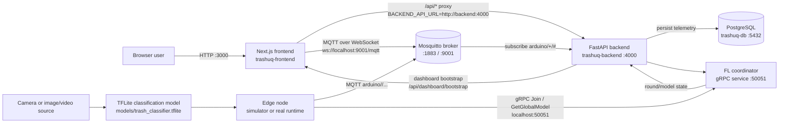
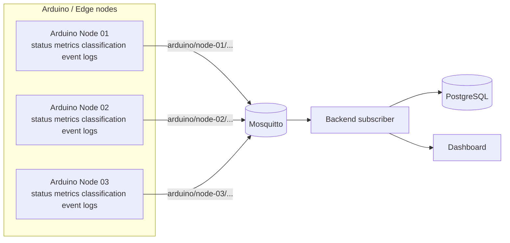
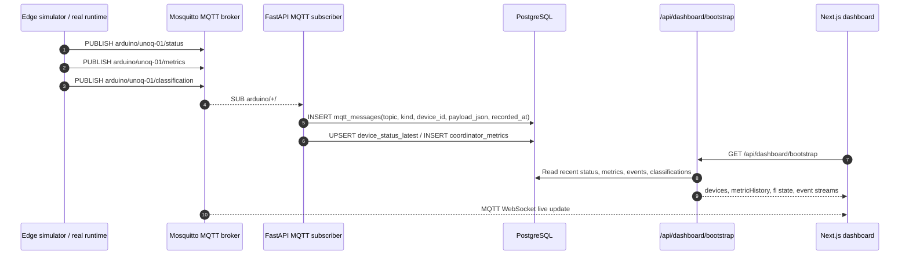
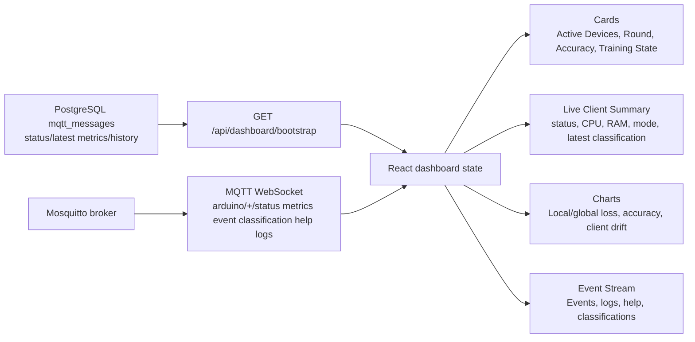
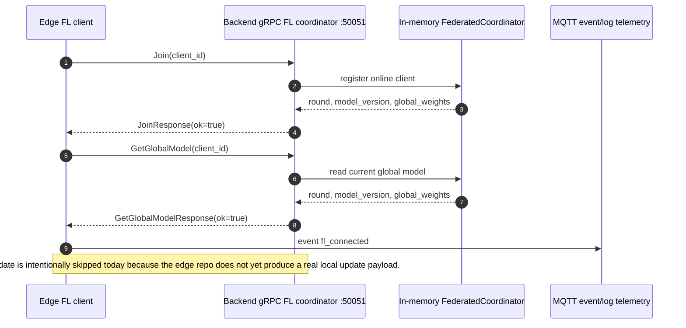
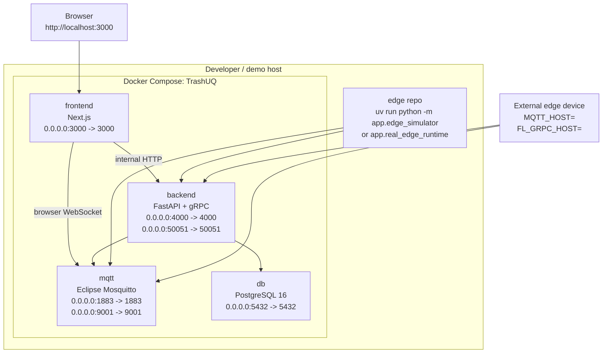

# TrashUQ: Plataforma Edge AI con Aprendizaje Federado para Monitorización Inteligente de Residuos

**Subtítulo:** Edge AI + Federated Learning trash detection dashboard  
**Proyecto:** TrashUQ  
**Repositorios:** `TrashUQ/` y `edge/`  
**Equipo / autores:** Equipo TrashUQ  
**Fecha:** 2026-05-14  
**Versión del informe:** 1.0

> **Resumen ejecutivo.** TrashUQ implementa una plataforma edge-to-cloud para monitorizar dispositivos de clasificación de residuos mediante MQTT, persistencia en PostgreSQL, visualización en un dashboard Next.js y coordinación inicial de Federated Learning vía gRPC. El sistema ya demuestra una ruta real de telemetría desde el cliente edge hasta la base de datos y la interfaz. La inferencia real con cámara está preparada mediante un runtime TFLite, mientras que el entrenamiento federado local y `SubmitUpdate` permanecen como trabajo futuro.

## Abstract

TrashUQ es una plataforma de monitorización inteligente de residuos basada en Edge AI, MQTT y Federated Learning. Los nodos edge, ya sea mediante el simulador sin hardware o mediante el runtime preparado para cámara/modelo real, publican estado, métricas, clasificaciones, eventos, logs y solicitudes de ayuda en tópicos MQTT bajo `arduino/<device-id>/...`. El backend FastAPI se suscribe a `arduino/+/#`, persiste los mensajes en PostgreSQL y expone un estado agregado mediante `/api/dashboard/bootstrap`. El frontend Next.js consume ese estado inicial, escucha actualizaciones en vivo por MQTT WebSocket y visualiza dispositivos, métricas, historial, clasificaciones y eventos. En paralelo, el backend ejecuta un coordinador gRPC de Federated Learning en `localhost:50051`; actualmente `Join` y `GetGlobalModel` funcionan como smoke test real, mientras que `SubmitUpdate` se omite de forma explícita porque el repositorio edge todavía no produce actualizaciones locales entrenadas.

## Executive Summary

| Capability | Estado | Evidencia |
|---|---:|---|
| MQTT edge telemetry | Implementado | `edge/app/edge_simulator.py` publica en `arduino/<device-id>/...`; `TrashUQ/backend/app/mqtt_runtime.py` se suscribe a `arduino/+/#`. |
| Backend persistence | Implementado | `mqtt_messages`, `device_status_latest`, `device_status_history` y `coordinator_metrics` en `TrashUQ/backend/app/db.py`. |
| Dashboard live monitoring | Implementado | `/api/dashboard/bootstrap` + MQTT WebSocket `ws://localhost:9001/mqtt` en `TrashUQ/frontend/app/page.tsx`. |
| gRPC FL Join/GetGlobalModel | Implementado | `TrashUQ/backend/app/fl.proto`, `grpc_server.py` y `edge/scripts/test_fl_grpc.py`. |
| Real camera inference | Preparado | `edge/app/model_runner.py`, `camera_runtime.py`, `real_edge_runtime.py`. |
| SubmitUpdate / local FL training | Pendiente | `edge/scripts/test_fl_grpc.py` lo omite; no existe payload local real de entrenamiento. |

## 1. Introducción

La monitorización de residuos urbanos requiere información operacional de baja latencia: estado de los dispositivos, consumo de recursos, eventos de clasificación, confianza del modelo y trazabilidad histórica. En un entorno real, transmitir vídeo sin procesar hacia la nube es costoso, frágil y poco escalable. TrashUQ adopta una arquitectura Edge AI para ejecutar inferencia cerca del sensor y enviar únicamente telemetría estructurada.

MQTT encaja con este tipo de sistema porque es ligero, tolerante a enlaces inestables y está diseñado para comunicación publish/subscribe entre dispositivos. PostgreSQL aporta persistencia verificable e histórico para reconstruir el estado del dashboard después de reinicios. El frontend ofrece una vista operacional para demos y validación. La capa de Federated Learning prepara el camino para entrenar modelos distribuidos sin centralizar datos crudos, aunque el entrenamiento local real aún no está implementado.

## 2. System Overview

TrashUQ se divide en dos repositorios:

| Repositorio | Responsabilidad |
|---|---|
| `TrashUQ/` | Docker Compose, Mosquitto, PostgreSQL, backend FastAPI/gRPC, frontend Next.js. |
| `edge/` | Cliente MQTT, simulador, smoke tests gRPC, wrapper de modelo TFLite y runtime de cámara/imagen/vídeo. |

La arquitectura operativa es una ruta edge-to-cloud real:

1. El dispositivo edge publica telemetría MQTT.
2. Mosquitto recibe mensajes en `1883` y WebSocket en `9001`.
3. El backend se suscribe a `arduino/+/#`.
4. El backend persiste cada mensaje en PostgreSQL.
5. `/api/dashboard/bootstrap` reconstruye estado inicial e histórico reciente.
6. El dashboard muestra estado y también escucha MQTT WebSocket para actualizaciones live.
7. El cliente edge puede contactar al coordinador FL gRPC para `Join` y `GetGlobalModel`.



## 3. Hardware and Edge Layer

La capa edge representa el nodo que en producción ejecutará la lectura de cámara, inferencia local y publicación MQTT. El sistema ya puede ejecutarse sin hardware mediante `edge/app/edge_simulator.py`, y también contiene una preparación para inferencia real:

| Elemento | Estado | Archivo |
|---|---:|---|
| Simulador edge sin hardware | Implementado | `edge/app/edge_simulator.py` |
| Cliente MQTT reusable | Implementado | `edge/app/mqtt_client.py` |
| Cliente gRPC FL smoke | Implementado | `edge/app/fl_client.py` |
| Wrapper de modelo real | Preparado | `edge/app/model_runner.py` |
| Cámara/imagen/vídeo runtime | Preparado | `edge/app/camera_runtime.py`, `edge/app/real_edge_runtime.py` |
| Modelo detectado | Preparado | `edge/models/trash_classifier.tflite` |

El modelo confirmado en el repositorio es TensorFlow Lite, con etiquetas por defecto `cardboard`, `glass`, `paper`, `plastic`. La salida normalizada en `ModelRunner.predict()` es clasificación:

```json
[
  {
    "label": "plastic",
    "confidence": 0.91,
    "bbox": null
  }
]
```

> **Nota técnica.** El modelo actualmente documentado es classification-only. No se debe presentar como object detection ni como sistema con bounding boxes reales. El campo `bbox` se publica como `null` en el runtime real porque el modelo no produce coordenadas.

Escalado conceptual a múltiples nodos:



## 4. MQTT Communication Layer

El root topic real es `arduino`, definido por `MQTT_TOPIC_ROOT` y usado por backend y frontend. Los tópicos esperados son:

| Tópico | Uso |
|---|---|
| `arduino/<device-id>/status` | Estado operativo del dispositivo. |
| `arduino/<device-id>/metrics` | Métricas de inferencia, recursos y métricas FL simuladas/telemetría. |
| `arduino/<device-id>/classification` | Resultado de clasificación. |
| `arduino/<device-id>/event` | Eventos estructurados. |
| `arduino/<device-id>/logs` | Logs del runtime edge. |
| `arduino/<device-id>/help` | Solicitudes de revisión o ayuda. |

Payload real de status compatible con dashboard:

```json
{
  "device_id": "unoq-01",
  "online": true,
  "status": "online",
  "state": "running",
  "mode": "simulation",
  "cpu": 55,
  "ram": 39,
  "cpu_percent": 55,
  "ram_percent": 39,
  "temp": "47.0 C",
  "heartbeat": "42 ms",
  "model_version": "simulated-v1",
  "ts": "2026-05-14T12:00:00Z"
}
```

Payload de metrics usado para cards y charts:

```json
{
  "device_id": "unoq-01",
  "fps": 12.4,
  "inference_ms": 83.0,
  "cpu_percent": 55,
  "ram_percent": 39,
  "globalAccuracy": 82.4,
  "globalLoss": 0.31,
  "localLoss": 0.42,
  "localAccuracy": 80.1,
  "round": 3,
  "samplesTrained": 256,
  "drift": 2.1,
  "mode": "simulation",
  "ts": "2026-05-14T12:00:00Z"
}
```

Payload de clasificación:

```json
{
  "device_id": "unoq-01",
  "label": "plastic",
  "confidence": 0.91,
  "bbox": null,
  "source": "real_model",
  "model_version": "trash_classifier.tflite",
  "inference_ms": 83.0,
  "ts": "2026-05-14T12:00:00Z"
}
```

Payload de evento:

```json
{
  "device_id": "unoq-01",
  "type": "classification_detected",
  "severity": "info",
  "message": "plastic detected with confidence 0.91",
  "label": "plastic",
  "confidence": 0.91,
  "source": "real_model",
  "ts": "2026-05-14T12:00:00Z"
}
```

Payload de log:

```json
{
  "device_id": "unoq-01",
  "level": "info",
  "message": "Inference started",
  "source": "real_model",
  "ts": "2026-05-14T12:00:00Z"
}
```



## 5. Backend Architecture

El backend se implementa con FastAPI y arranca tres responsabilidades en `TrashUQ/backend/app/main.py`:

1. `ensure_schema()` inicializa tablas e índices.
2. `GrpcServerRuntime` expone el servicio FL gRPC.
3. `MqttIngestRuntime` se conecta a Mosquitto y se suscribe a `arduino/+/#`.

Endpoints HTTP principales:

| Endpoint | Respuesta |
|---|---|
| `GET /health` | `{"ok": true}` |
| `GET /api/dashboard/bootstrap` | Estado real para dashboard: devices, metrics, metricHistory, streams y estado FL. |
| `GET /api/fl/state` | Snapshot mínimo del coordinador FL. |

Componentes y puertos reales:

| Component | Responsibility | Port | Technology |
|---|---|---:|---|
| `frontend` | Dashboard, proxy API, MQTT WebSocket client | `3000` | Next.js |
| `backend` | REST API, MQTT ingest, gRPC FL runtime | `4000`, `50051` | FastAPI, grpcio |
| `mqtt` | Broker MQTT y WebSocket | `1883`, `9001` | Eclipse Mosquitto |
| `db` | Persistencia de telemetría e histórico | `5432` host mapping por defecto | PostgreSQL 16 |
| `edge` | Cliente, simulador, runtime real | proceso local | Python, OpenCV, MQTT, gRPC |

El proxy frontend se define en `TrashUQ/frontend/app/api/[...path]/route.ts` y usa `BACKEND_API_URL=http://backend:4000` dentro de Docker. Esto evita el error clásico de intentar llamar a `127.0.0.1:4000` desde el contenedor frontend.

## 6. Database Layer

PostgreSQL actúa como fuente verificable del histórico MQTT. El esquema se inicializa en `TrashUQ/backend/app/db.py`.

Tablas relevantes:

| Tabla | Uso |
|---|---|
| `mqtt_messages` | Registro completo de cada mensaje MQTT recibido. |
| `device_status_latest` | Último estado parseado por dispositivo. |
| `device_status_history` | Histórico de estados. |
| `coordinator_metrics` | Métricas agregadas derivadas de payloads `metrics`. |

Campos principales de `mqtt_messages`:

| Campo | Significado |
|---|---|
| `topic` | Tópico MQTT completo. |
| `kind` | `status`, `metrics`, `event`, `classification`, `help`, `logs` u `other`. |
| `device_id` | Device ID inferido del tópico. |
| `payload_text` / `payload` | Payload original como texto. |
| `payload_json` | JSONB si el payload es JSON válido. |
| `recorded_at` | Timestamp en milisegundos. |
| `created_at` | Timestamp SQL derivado. |

Consulta de verificación:

```sh
docker compose exec db psql -U trashuq -d dashboard -c "select topic, payload, created_at from mqtt_messages order by created_at desc limit 20;"
```

## 7. Frontend Dashboard

El dashboard Next.js consume datos por dos vías:

1. Bootstrap inicial y polling: `fetch("/api/dashboard/bootstrap")`.
2. Actualización live: MQTT WebSocket `ws://localhost:9001/mqtt`.

El frontend no necesita mocks para la ruta principal. Si no hay datos reales, muestra estados vacíos o mensajes de espera. Las vistas principales incluyen:

| Vista / elemento | Fuente real |
|---|---|
| Active Devices | `devices` desde bootstrap + status MQTT live. |
| Current Round | estado FL y métricas MQTT con `round`. |
| Global Accuracy / Loss | `metrics.globalAccuracy`, `metrics.globalLoss`, `metricHistory`. |
| Avg CPU / RAM | status y metrics MQTT parseados. |
| Live Client Summary | estado, CPU, RAM, mode, latest classification, confidence. |
| Event Stream | `event`, `logs` y MQTT live. |
| Local Training Loss chart | `metricHistory` con `localLoss` / `globalLoss`. |
| Client Drift chart | `metricHistory` con `drift`. |

Cuando no existe métrica FL real para loss o drift, el dashboard muestra waiting states como “Waiting for FL metric data...” en vez de pintar curvas falsas.



## 8. Federated Learning Layer

La capa FL usa gRPC y el proto real en `TrashUQ/backend/app/fl.proto`.

RPCs disponibles:

| RPC | Request | Response |
|---|---|---|
| `Join` | `client_id` | `ok`, `message`, `round`, `model_version`, `global_weights` |
| `GetGlobalModel` | `client_id` | `ok`, `message`, `round`, `model_version`, `global_weights` |
| `SubmitUpdate` | `client_id`, `round`, `num_samples`, `local_weights`, `local_loss`, `local_accuracy` | `ok`, `message`, `round_aggregated`, `current_round`, `model_version` |

El coordinador actual mantiene estado en memoria: clientes online, ronda, versión de modelo, pesos globales y updates pendientes. El tamaño del modelo por defecto es `FL_MODEL_SIZE=16` y el mínimo por ronda es `FL_MIN_CLIENTS_PER_ROUND=2`.

Estado actual:

| Capacidad | Estado |
|---|---:|
| `Join` desde edge | Funciona. |
| `GetGlobalModel` desde edge | Funciona. |
| `SubmitUpdate` desde edge | Se omite correctamente. |
| Entrenamiento local real | Pendiente. |



## 9. Edge Simulator and No-Hardware Demo

El simulador es una pieza clave para demos sin hardware. No es un mock de frontend: publica mensajes MQTT reales hacia Mosquitto, el backend los persiste en PostgreSQL y el dashboard los consume por la misma ruta que usaría un dispositivo real.

Comando principal:

```sh
cd ~/Documents/TrashNet/edge
uv run python -m app.edge_simulator
```

El simulador publica:

| Tipo | Contenido |
|---|---|
| `status` | online/offline, CPU, RAM, temperatura, heartbeat, modo. |
| `metrics` | FPS, inferencia, CPU/RAM, accuracy/loss, round, samples, drift. |
| `classification` | etiquetas simuladas como `trash`, `plastic`, `paper`, `metal`, `organic`, `clean`. |
| `event` | eventos de detección. |
| `logs` | actividad del loop. |
| `help` | revisión si la confianza es baja. |

## 10. Real Model Runtime Preparation

El repositorio `edge/` ya contiene la preparación para ejecutar inferencia real:

| Archivo | Función |
|---|---|
| `edge/app/model_runner.py` | Carga `models/trash_classifier.tflite` mediante el clasificador existente. |
| `edge/app/camera_runtime.py` | Fuente de frames: `camera`, `image`, `video`. |
| `edge/app/real_edge_runtime.py` | Loop de inferencia, MQTT publish y smoke FL no bloqueante. |
| `edge/scripts/test_model_load.py` | Verifica carga del modelo. |
| `edge/scripts/test_camera_open.py` | Verifica apertura de cámara. |
| `edge/scripts/test_single_image_inference.py` | Ejecuta inferencia sobre una imagen. |

Variables principales:

```sh
EDGE_INPUT_SOURCE=camera
EDGE_CAMERA_INDEX=0
EDGE_IMAGE_PATH=
EDGE_VIDEO_PATH=
EDGE_MODEL_PATH=models/trash_classifier.tflite
EDGE_CONFIDENCE_THRESHOLD=0.5
EDGE_INFERENCE_INTERVAL_SEC=1
EDGE_MAX_FPS=10
```

> **Limitación actual.** El runtime real requiere `tflite_runtime` o TensorFlow Lite compatible. En el entorno local inspeccionado, el test de modelo falla de forma explícita si esa dependencia no está instalada; esto es correcto porque no se debe simular inferencia real.

## 11. Verification and Testing

### Start full stack

```sh
cd ~/Documents/TrashNet/TrashUQ
docker compose down
docker compose up --build
```

### Backend health

```sh
curl http://localhost:4000/health
curl http://localhost:4000/api/dashboard/bootstrap
```

### Frontend proxy

```sh
curl http://localhost:3000/api/dashboard/bootstrap
docker compose exec frontend sh -lc 'wget -qO- http://backend:4000/health || curl -s http://backend:4000/health'
```

### MQTT monitor

```sh
cd ~/Documents/TrashNet/TrashUQ
docker compose exec mqtt mosquitto_sub -h localhost -p 1883 -t 'arduino/+/+' -v
```

### Edge simulator

```sh
cd ~/Documents/TrashNet/edge
uv run python -m app.edge_simulator
```

### gRPC smoke

```sh
cd ~/Documents/TrashNet/edge
uv run python scripts/test_fl_grpc.py
```

Resultado esperado:

```text
Join: ok=True ...
GetGlobalModel: ok=True ...
SubmitUpdate skipped: real local training/model update is not implemented in the edge repo yet.
```

### Model load

```sh
cd ~/Documents/TrashNet/edge
uv run python scripts/test_model_load.py
```

### DB verification

```sh
cd ~/Documents/TrashNet/TrashUQ
docker compose exec db psql -U trashuq -d dashboard -c "select topic, payload, created_at from mqtt_messages order by created_at desc limit 20;"
```

## 12. Results

Resultados alcanzados:

| Resultado | Estado |
|---|---:|
| MQTT end-to-end desde edge a broker | Verificado. |
| Persistencia backend en PostgreSQL | Verificado. |
| Dashboard recibe datos reales por bootstrap y WebSocket | Verificado. |
| Simulador edge llena cards, streams y charts mediante MQTT real | Implementado. |
| Charts usan historial real `metricHistory` o waiting state | Implementado. |
| gRPC `Join` y `GetGlobalModel` | Verificado. |
| Wrapper de modelo real TFLite | Implementado/preparado. |
| Runtime de cámara/imagen/vídeo | Implementado/preparado. |

Resultados no reclamados:

| Elemento | Motivo |
|---|---|
| Entrenamiento local federado real | No hay implementación que produzca `local_weights`, `local_loss`, `local_accuracy`. |
| `SubmitUpdate` real | Se omite de forma explícita. |
| Bounding boxes reales | El modelo detectado es classification-only. |
| Ejecución real TFLite garantizada en cualquier host | Depende de instalar runtime compatible. |

## 13. Limitaciones

- `SubmitUpdate` real no está implementado en el edge repo.
- No existe aún tracking de privacy budget.
- No existe dashboard específico de calidad de dataset.
- No se miden costes de comunicación por ronda FL.
- El modelo actual es de clasificación, no detección con bounding boxes.
- La ejecución con cámara depende del hardware, permisos del dispositivo y runtime TFLite.
- El coordinador FL mantiene estado en memoria; no persiste rondas o pesos globales en base de datos.
- La seguridad MQTT/gRPC está preparada para configuración básica, pero no hay hardening completo de producción.

## 14. Future Work

- Conectar cámara y hardware Arduino/edge.
- Instalar `tflite_runtime` o TensorFlow Lite en el dispositivo objetivo.
- Ejecutar stream real de clasificación y observarlo en dashboard.
- Añadir fine-tuning o entrenamiento local real en edge.
- Implementar `SubmitUpdate` con payload válido.
- Persistir rondas FL, pesos globales y métricas por cliente.
- Añadir model registry y versionado operacional.
- Implementar analytics por dispositivo.
- Añadir drift detection de dataset y modelo.
- Endurecer seguridad: autenticación MQTT, TLS, credenciales gRPC, autorización por dispositivo.
- Desplegar una flota real de nodos edge.

## 15. Demo Script

Guion recomendado para una demo live:

1. Arrancar la plataforma:

```sh
cd ~/Documents/TrashNet/TrashUQ
docker compose up --build
```

2. Abrir el dashboard:

```text
http://localhost:3000
```

3. Ejecutar el simulador edge:

```sh
cd ~/Documents/TrashNet/edge
uv run python -m app.edge_simulator
```

4. Mostrar en el dashboard:

- `unoq-01` online.
- CPU/RAM/heartbeat actualizándose.
- Clasificaciones en vivo.
- Event Stream con mensajes reales MQTT.
- Charts de loss/drift si llegan métricas con `localLoss`, `globalLoss` y `drift`.

5. Verificar persistencia:

```sh
cd ~/Documents/TrashNet/TrashUQ
docker compose exec db psql -U trashuq -d dashboard -c "select topic, payload, created_at from mqtt_messages order by created_at desc limit 20;"
```

6. Verificar gRPC:

```sh
cd ~/Documents/TrashNet/edge
uv run python scripts/test_fl_grpc.py
```

7. Explicar readiness de cámara/modelo:

```sh
cd ~/Documents/TrashNet/edge
EDGE_CAMERA_INDEX=0 uv run python scripts/test_camera_open.py
uv run python scripts/test_model_load.py
```

## 16. Deployment Topology



## 17. Glossary

| Term | Definición |
|---|---|
| Edge AI | Inferencia de IA ejecutada cerca del sensor/dispositivo. |
| MQTT | Protocolo publish/subscribe ligero para telemetría. |
| gRPC | RPC binario basado en HTTP/2 y Protocol Buffers. |
| Federated Learning | Entrenamiento distribuido donde los clientes envían updates, no datos crudos. |
| Global model | Modelo agregado mantenido por el coordinador FL. |
| Local update | Actualización entrenada localmente por un cliente edge. |
| Dashboard bootstrap | Estado inicial servido por backend para reconstruir el dashboard. |
| Telemetry | Métricas, eventos, logs y estado operacional enviados por dispositivos. |
| TFLite | TensorFlow Lite, runtime/model format optimizado para edge. |

## 18. Conclusión

TrashUQ ya demuestra una canalización real edge-to-cloud: un cliente edge publica MQTT, Mosquitto enruta mensajes, FastAPI persiste en PostgreSQL, y el dashboard visualiza estado y métricas en vivo. El simulador permite una demo completa sin hardware, pero no falsifica datos en frontend: todo atraviesa la infraestructura real. La integración gRPC valida el camino de coordinación federada con `Join` y `GetGlobalModel`, y el runtime TFLite prepara el salto hacia cámara/modelo real. El siguiente hito técnico es cerrar el bucle de entrenamiento local: generar updates válidos en edge, enviar `SubmitUpdate` y persistir métricas FL de producción por ronda y dispositivo.
