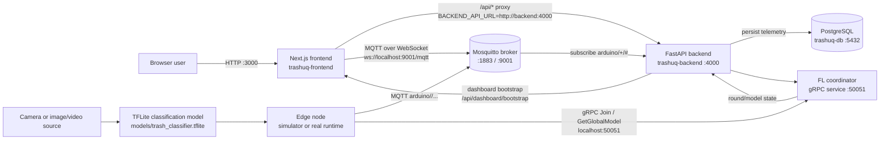
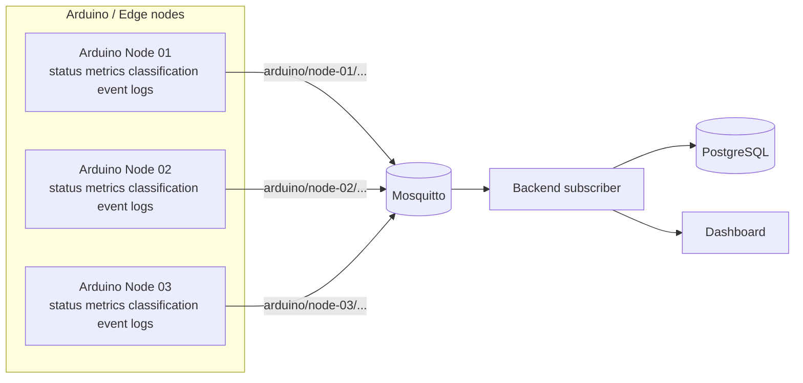
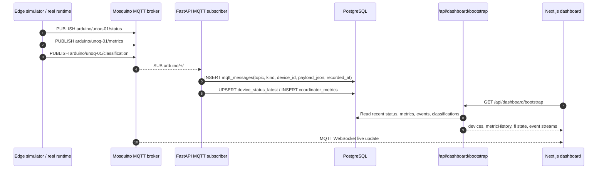
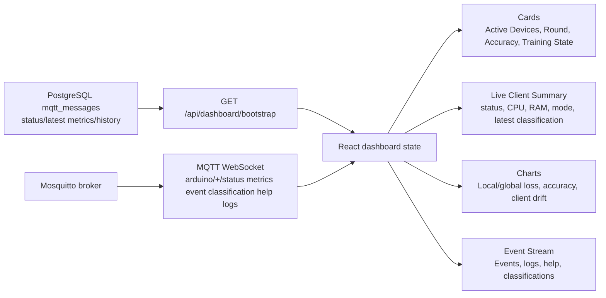
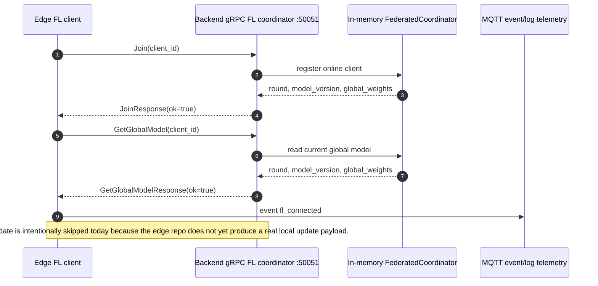
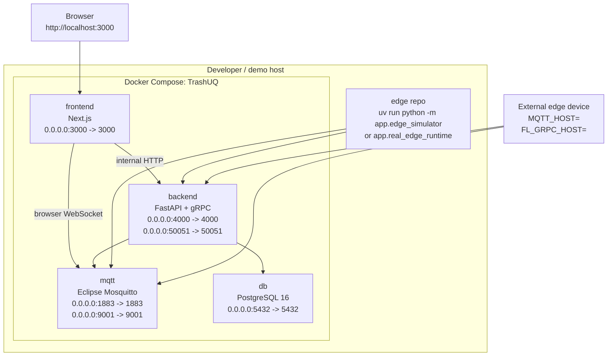

\begin{titlepage}
\centering
\vspace*{1.0cm}
\includegraphics[width=0.36\textwidth]{docs/paper/assets/udl_logo.png}

\vspace{2.0cm}
{\Huge\bfseries TrashUQ\par}
\vspace{0.45cm}
{\Large\bfseries An Edge AI and Federated Learning Platform\\for Intelligent Waste Monitoring\par}
\vspace{1.4cm}
{\large Technical Report and Demonstration Paper\par}

\vspace{1.6cm}
{\large Pol Llinàs\\Bru Pallàs\\Aleix Bertran\\Aleix Rosinach\par}

\vfill
{\large Universitat de Lleida\par}
{\large Repositories: \texttt{TrashUQ/} and \texttt{edge/}\par}
{\large May 14, 2026\par}
\end{titlepage}

\newpage
\tableofcontents
\newpage

> **Executive statement.** TrashUQ demonstrates a real edge-to-cloud telemetry and monitoring pipeline for intelligent waste classification. Edge clients publish MQTT telemetry and classification events, the backend persists the messages in PostgreSQL, the dashboard visualizes live device state and federated-learning metrics, and a gRPC coordinator exposes the initial Federated Learning control path. The no-hardware simulator is not a frontend mock: it publishes real MQTT traffic through the same backend, database, and dashboard path used by real edge devices.

# Abstract {-}

TrashUQ is an Edge AI and Federated Learning platform for intelligent waste monitoring. Edge devices, currently represented by a verified simulator and a prepared real camera/model runtime, publish status, metrics, classifications, events, logs, and help requests over MQTT topics rooted at `arduino/<device-id>/...`. The FastAPI backend subscribes to `arduino/+/#`, persists every MQTT message in PostgreSQL, and exposes a normalized dashboard state through `/api/dashboard/bootstrap`. The Next.js frontend consumes this backend bootstrap state and also subscribes to MQTT over WebSocket for live updates. In parallel, the backend exposes a gRPC Federated Learning coordinator on port `50051`; `Join` and `GetGlobalModel` are implemented and verified, while `SubmitUpdate` is intentionally skipped in the edge smoke test because real local training and update generation are not implemented yet. The real model path is prepared around a TensorFlow Lite classification model, not an object detector.

# Executive Summary {-}

| Capability | Status | Evidence |
|---|---:|---|
| MQTT edge telemetry | Implemented | `edge/app/edge_simulator.py` publishes to `arduino/<device-id>/...`; `TrashUQ/backend/app/mqtt_runtime.py` subscribes to `arduino/+/#`. |
| Backend persistence | Implemented | `mqtt_messages`, `device_status_latest`, `device_status_history`, and `coordinator_metrics` are created in `TrashUQ/backend/app/db.py`. |
| Dashboard live monitoring | Implemented | `/api/dashboard/bootstrap` plus MQTT WebSocket `ws://localhost:9001/mqtt` in `TrashUQ/frontend/app/page.tsx`. |
| gRPC FL Join/GetGlobalModel | Implemented | `TrashUQ/backend/app/fl.proto`, `grpc_server.py`, and `edge/scripts/test_fl_grpc.py`. |
| Real camera inference | Prepared | `edge/app/model_runner.py`, `camera_runtime.py`, and `real_edge_runtime.py`. |
| SubmitUpdate / local FL training | Pending | The edge smoke test skips `SubmitUpdate`; no real local update payload exists yet. |

# Introduction

Waste monitoring systems need timely operational data: device availability, resource usage, inference latency, model confidence, event history, and fleet-level visibility. Sending raw video streams to a central server is expensive, fragile, and difficult to scale. TrashUQ therefore follows an Edge AI design: inference is intended to run close to the camera, and only structured telemetry is sent to the backend.

MQTT is used because it is lightweight, publish/subscribe oriented, and appropriate for edge telemetry. PostgreSQL gives the system durable, inspectable storage so the dashboard can be reconstructed after restarts. The web dashboard provides a real-time operational interface for demos and debugging. The Federated Learning layer prepares the coordination path for distributed model training without centralizing raw training data, although real local training is explicitly future work.

# System Overview

The project is split across two repositories:

| Repository | Responsibility |
|---|---|
| `TrashUQ/` | Docker Compose stack, Mosquitto, PostgreSQL, FastAPI backend, gRPC FL server, Next.js frontend. |
| `edge/` | MQTT edge client, no-hardware simulator, gRPC smoke tests, TensorFlow Lite model wrapper, camera/image/video runtime. |

The implemented operational path is:

1. An edge client publishes MQTT telemetry.
2. Mosquitto receives MQTT traffic on `1883` and MQTT WebSocket traffic on `9001`.
3. The backend subscribes to `arduino/+/#`.
4. The backend stores every MQTT message in PostgreSQL.
5. `/api/dashboard/bootstrap` returns normalized device, metric, event, classification, and FL state.
6. The dashboard renders bootstrap data and applies live MQTT WebSocket updates.
7. The edge client can contact the gRPC FL coordinator for `Join` and `GetGlobalModel`.



# Hardware and Edge Layer

The edge layer represents the device that will eventually read frames from a camera, run local inference, and publish telemetry to TrashUQ. The no-hardware simulator is already operational, while the real runtime is prepared for camera, image, or video input.

| Element | Status | File |
|---|---:|---|
| No-hardware simulator | Implemented | `edge/app/edge_simulator.py` |
| Reusable MQTT client | Implemented | `edge/app/mqtt_client.py` |
| gRPC FL smoke client | Implemented | `edge/app/fl_client.py` |
| Real model wrapper | Prepared | `edge/app/model_runner.py` |
| Camera/image/video runtime | Prepared | `edge/app/camera_runtime.py`, `edge/app/real_edge_runtime.py` |
| Detected model artifact | Prepared | `edge/models/trash_classifier.tflite` |

The model discovered in the repository is TensorFlow Lite. The default labels are `cardboard`, `glass`, `paper`, and `plastic`. The normalized runtime output is classification-only:

```json
[
  {
    "label": "plastic",
    "confidence": 0.91,
    "bbox": null
  }
]
```

> **Technical note.** The detected model is a classification model, not an object detection model. TrashUQ must not be presented as producing real bounding boxes until an object detection model is introduced.

Multi-device scalability is represented by the topic structure:



# MQTT Communication Layer

The MQTT topic root is `arduino`, configured through `MQTT_TOPIC_ROOT`. The backend subscribes to `arduino/+/#`, and the frontend subscribes to the same device topic family over MQTT WebSocket.

| Topic | Purpose |
|---|---|
| `arduino/<device-id>/status` | Device operational state. |
| `arduino/<device-id>/metrics` | Inference, resource, and FL-style metric telemetry. |
| `arduino/<device-id>/classification` | Classification result. |
| `arduino/<device-id>/event` | Structured runtime or detection events. |
| `arduino/<device-id>/logs` | Edge runtime logs. |
| `arduino/<device-id>/help` | Help or review requests. |

Status payload:

```json
{
  "device_id": "unoq-01",
  "online": true,
  "status": "online",
  "state": "running",
  "mode": "simulation",
  "cpu": 55,
  "ram": 39,
  "cpu_percent": 55,
  "ram_percent": 39,
  "temp": "47.0 C",
  "heartbeat": "42 ms",
  "model_version": "simulated-v1",
  "ts": "2026-05-14T12:00:00Z"
}
```

Metrics payload:

```json
{
  "device_id": "unoq-01",
  "fps": 12.4,
  "inference_ms": 83.0,
  "cpu_percent": 55,
  "ram_percent": 39,
  "globalAccuracy": 82.4,
  "globalLoss": 0.31,
  "localLoss": 0.42,
  "localAccuracy": 80.1,
  "round": 3,
  "samplesTrained": 256,
  "drift": 2.1,
  "mode": "simulation",
  "ts": "2026-05-14T12:00:00Z"
}
```

Classification payload from the real runtime:

```json
{
  "device_id": "unoq-01",
  "label": "plastic",
  "confidence": 0.91,
  "bbox": null,
  "source": "real_model",
  "model_version": "trash_classifier.tflite",
  "inference_ms": 83.0,
  "ts": "2026-05-14T12:00:00Z"
}
```

Event payload:

```json
{
  "device_id": "unoq-01",
  "type": "classification_detected",
  "severity": "info",
  "message": "plastic detected with confidence 0.91",
  "label": "plastic",
  "confidence": 0.91,
  "source": "real_model",
  "ts": "2026-05-14T12:00:00Z"
}
```

Log payload:

```json
{
  "device_id": "unoq-01",
  "level": "info",
  "message": "Inference started",
  "source": "real_model",
  "ts": "2026-05-14T12:00:00Z"
}
```



# Backend Architecture

The backend is a FastAPI service. On startup, `TrashUQ/backend/app/main.py` initializes the database schema, starts the gRPC server, and starts the MQTT ingest runtime.

HTTP endpoints:

| Endpoint | Purpose |
|---|---|
| `GET /health` | Health check returning `{"ok": true}`. |
| `GET /api/dashboard/bootstrap` | Normalized dashboard state from PostgreSQL and FL coordinator state. |
| `GET /api/fl/state` | Minimal FL coordinator snapshot. |

Real service topology:

| Component | Responsibility | Port | Technology |
|---|---|---:|---|
| `frontend` | Dashboard, API proxy, MQTT WebSocket client | `3000` | Next.js |
| `backend` | REST API, MQTT ingest, gRPC FL runtime | `4000`, `50051` | FastAPI, grpcio |
| `mqtt` | MQTT and WebSocket broker | `1883`, `9001` | Eclipse Mosquitto |
| `db` | Telemetry and history persistence | `5432` host mapping by default | PostgreSQL 16 |
| `edge` | Simulator and real runtime | local process | Python, OpenCV, MQTT, gRPC |

The frontend API route `TrashUQ/frontend/app/api/[...path]/route.ts` proxies `/api/*` requests to `BACKEND_API_URL=http://backend:4000` inside Docker. Browser-side MQTT connects to `ws://localhost:9001/mqtt`, which is correct because the WebSocket is opened from the user’s browser.

# Database Layer

PostgreSQL provides a durable telemetry log and derived dashboard state. The schema is created in `TrashUQ/backend/app/db.py`.

| Table | Purpose |
|---|---|
| `mqtt_messages` | Full record of every MQTT message received. |
| `device_status_latest` | Latest parsed device state. |
| `device_status_history` | Historical device states. |
| `coordinator_metrics` | Aggregated metrics derived from `metrics` payloads. |

Main `mqtt_messages` fields:

| Field | Meaning |
|---|---|
| `topic` | Full MQTT topic. |
| `kind` | `status`, `metrics`, `event`, `classification`, `help`, `logs`, or `other`. |
| `device_id` | Device identifier inferred from the topic. |
| `payload_text` / `payload` | Original payload as text. |
| `payload_json` | JSONB payload if parsing succeeds. |
| `recorded_at` | Millisecond timestamp. |
| `created_at` | SQL timestamp derived from `recorded_at`. |

Verification query:

```sh
docker compose exec db psql -U trashuq -d dashboard -c "select topic, payload, created_at from mqtt_messages order by created_at desc limit 20;"
```

# Frontend Dashboard

The dashboard consumes data through two live paths:

1. Initial and periodic bootstrap: `fetch("/api/dashboard/bootstrap")`.
2. Real-time updates: MQTT WebSocket `ws://localhost:9001/mqtt`.

The main dashboard path does not use mock devices. If real data is unavailable, the UI shows empty or waiting states instead of fabricated curves.

| Dashboard area | Real source |
|---|---|
| Active Devices | `devices` from bootstrap plus live status MQTT. |
| Current Round | FL state and metrics payloads containing `round`. |
| Global Accuracy / Loss | `metrics.globalAccuracy`, `metrics.globalLoss`, and `metricHistory`. |
| Average CPU / RAM | Parsed status and metrics MQTT payloads. |
| Live Client Summary | Device state, CPU, RAM, mode, latest classification, confidence. |
| Event Stream | `event`, `logs`, and MQTT live updates. |
| Local Training Loss chart | `metricHistory` with `localLoss` / `globalLoss`. |
| Client Drift chart | `metricHistory` with `drift`. |



# Federated Learning Layer

Federated Learning coordination is exposed through the real proto file at `TrashUQ/backend/app/fl.proto`.

| RPC | Request fields | Response fields |
|---|---|---|
| `Join` | `client_id` | `ok`, `message`, `round`, `model_version`, `global_weights` |
| `GetGlobalModel` | `client_id` | `ok`, `message`, `round`, `model_version`, `global_weights` |
| `SubmitUpdate` | `client_id`, `round`, `num_samples`, `local_weights`, `local_loss`, `local_accuracy` | `ok`, `message`, `round_aggregated`, `current_round`, `model_version` |

The current coordinator stores state in memory: online clients, current round, model version, global weights, and pending updates. The default model size is controlled by `FL_MODEL_SIZE=16`, and the default minimum number of clients per round is `FL_MIN_CLIENTS_PER_ROUND=2`.

| Capability | Status |
|---|---:|
| Edge `Join` | Works. |
| Edge `GetGlobalModel` | Works. |
| Edge `SubmitUpdate` | Intentionally skipped. |
| Real local training | Pending. |



# Edge Simulator and No-Hardware Demo

The simulator enables a full demonstration without Arduino hardware, a camera, or a local model runtime. It is not a UI mock. It publishes real MQTT messages that are ingested by the real broker, persisted by the real backend, and displayed by the real dashboard.

Run it with:

```sh
cd ~/Documents/TrashNet/edge
uv run python -m app.edge_simulator
```

The simulator publishes:

| Type | Content |
|---|---|
| `status` | Online/offline state, CPU, RAM, temperature, heartbeat, mode. |
| `metrics` | FPS, inference latency, CPU/RAM, accuracy/loss, round, samples, drift. |
| `classification` | Simulated labels such as `trash`, `plastic`, `paper`, `metal`, `organic`, `clean`. |
| `event` | Detection and runtime events. |
| `logs` | Runtime loop activity. |
| `help` | Review/help requests when confidence is low. |

# Real Model Runtime Preparation

The `edge/` repository is prepared for real inference:

| File | Role |
|---|---|
| `edge/app/model_runner.py` | Loads `models/trash_classifier.tflite` through the existing classifier path. |
| `edge/app/camera_runtime.py` | Provides `camera`, `image`, and `video` frame sources. |
| `edge/app/real_edge_runtime.py` | Runs inference, publishes MQTT payloads, and performs non-blocking FL smoke checks. |
| `edge/scripts/test_model_load.py` | Verifies model loading. |
| `edge/scripts/test_camera_open.py` | Verifies camera access. |
| `edge/scripts/test_single_image_inference.py` | Runs inference on one image. |

Runtime variables:

```sh
EDGE_INPUT_SOURCE=camera
EDGE_CAMERA_INDEX=0
EDGE_IMAGE_PATH=
EDGE_VIDEO_PATH=
EDGE_MODEL_PATH=models/trash_classifier.tflite
EDGE_CONFIDENCE_THRESHOLD=0.5
EDGE_INFERENCE_INTERVAL_SEC=1
EDGE_MAX_FPS=10
```

> **Current limitation.** Real model execution requires `tflite_runtime` or TensorFlow Lite support in the target Python environment. If the dependency is missing, `test_model_load.py` fails clearly instead of pretending inference works.

# Verification and Testing

## Start the full stack

```sh
cd ~/Documents/TrashNet/TrashUQ
docker compose down
docker compose up --build
```

## Backend health

```sh
curl http://localhost:4000/health
curl http://localhost:4000/api/dashboard/bootstrap
```

## Frontend proxy

```sh
curl http://localhost:3000/api/dashboard/bootstrap
docker compose exec frontend sh -lc 'wget -qO- http://backend:4000/health || curl -s http://backend:4000/health'
```

## MQTT monitor

```sh
cd ~/Documents/TrashNet/TrashUQ
docker compose exec mqtt mosquitto_sub -h localhost -p 1883 -t 'arduino/+/+' -v
```

## Edge simulator

```sh
cd ~/Documents/TrashNet/edge
uv run python -m app.edge_simulator
```

## gRPC smoke test

```sh
cd ~/Documents/TrashNet/edge
uv run python scripts/test_fl_grpc.py
```

Expected result:

```text
Join: ok=True ...
GetGlobalModel: ok=True ...
SubmitUpdate skipped: real local training/model update is not implemented in the edge repo yet.
```

## Model load

```sh
cd ~/Documents/TrashNet/edge
uv run python scripts/test_model_load.py
```

## Database verification

```sh
cd ~/Documents/TrashNet/TrashUQ
docker compose exec db psql -U trashuq -d dashboard -c "select topic, payload, created_at from mqtt_messages order by created_at desc limit 20;"
```

# Results

| Result | Status |
|---|---:|
| MQTT end-to-end from edge to broker | Verified. |
| Backend persistence in PostgreSQL | Verified. |
| Dashboard receives real backend/MQTT data | Verified. |
| Edge simulator populates dashboard cards, streams, and charts through MQTT | Implemented. |
| Charts use real `metricHistory` or waiting states | Implemented. |
| gRPC `Join` and `GetGlobalModel` | Verified. |
| TensorFlow Lite model wrapper | Implemented/prepared. |
| Camera/image/video runtime | Implemented/prepared. |

Not claimed as completed:

| Item | Reason |
|---|---|
| Real federated local training | No implementation currently produces `local_weights`, `local_loss`, and `local_accuracy`. |
| Real `SubmitUpdate` | Intentionally skipped until local training exists. |
| Real bounding boxes | The detected model is classification-only. |
| Guaranteed TFLite execution on every host | Depends on a compatible TFLite runtime installation. |

# Limitations

- Real `SubmitUpdate` is not implemented in the edge repository.
- No privacy budget tracking is implemented yet.
- There is no dataset-quality dashboard yet.
- Communication cost per FL round is not measured yet.
- The current model is classification-only, not object detection.
- Camera execution depends on target hardware, camera permissions, and TFLite runtime availability.
- The FL coordinator stores its state in memory; rounds and global weights are not persisted yet.
- MQTT/gRPC security hardening remains future work.

# Future Work

- Connect Arduino/camera hardware.
- Install `tflite_runtime` or TensorFlow Lite on the target edge device.
- Run a real classification stream through the dashboard.
- Add real local training or fine-tuning.
- Implement `SubmitUpdate` with valid model updates.
- Persist FL rounds, global weights, and per-client metrics.
- Add a model registry and operational model versioning.
- Add per-device performance analytics.
- Add dataset and model drift detection.
- Harden security with MQTT authentication, TLS, device authorization, and gRPC credentials.
- Deploy to a real edge fleet.

# Demo Script

Recommended live demo flow:

1. Start the platform:

```sh
cd ~/Documents/TrashNet/TrashUQ
docker compose up --build
```

2. Open the dashboard:

```text
http://localhost:3000
```

3. Run the edge simulator:

```sh
cd ~/Documents/TrashNet/edge
uv run python -m app.edge_simulator
```

4. Show in the dashboard:

- `unoq-01` online.
- CPU/RAM/heartbeat updating.
- Live classification events.
- Real MQTT event stream.
- Loss/drift charts if metrics with `localLoss`, `globalLoss`, and `drift` are being published.

5. Verify database persistence:

```sh
cd ~/Documents/TrashNet/TrashUQ
docker compose exec db psql -U trashuq -d dashboard -c "select topic, payload, created_at from mqtt_messages order by created_at desc limit 20;"
```

6. Verify gRPC:

```sh
cd ~/Documents/TrashNet/edge
uv run python scripts/test_fl_grpc.py
```

7. Explain real camera/model readiness:

```sh
cd ~/Documents/TrashNet/edge
EDGE_CAMERA_INDEX=0 uv run python scripts/test_camera_open.py
uv run python scripts/test_model_load.py
```

# Deployment Topology



# Glossary

| Term | Definition |
|---|---|
| Edge AI | AI inference executed close to the sensor or device. |
| MQTT | Lightweight publish/subscribe protocol for telemetry. |
| gRPC | Binary RPC framework based on HTTP/2 and Protocol Buffers. |
| Federated Learning | Distributed learning where clients send updates instead of raw data. |
| Global model | Aggregated model maintained by the FL coordinator. |
| Local update | Locally trained client update submitted to the coordinator. |
| Dashboard bootstrap | Initial backend state used to reconstruct the dashboard. |
| Telemetry | Operational status, metrics, events, logs, and classifications. |
| TFLite | TensorFlow Lite, a model format/runtime optimized for edge environments. |

# Logo Source

The cover includes the Universitat de Lleida logo from Wikimedia Commons: `File:Logo Universitat de Lleida.svg`. The file page states that the source is `www.udl.cat` and identifies the asset as a public-domain text/logo. A local copy is stored in `docs/paper/assets/udl_logo.svg` and rendered to `docs/paper/assets/udl_logo.png` for PDF generation.

# Conclusion

TrashUQ already demonstrates a real edge-to-cloud monitoring platform: edge clients publish MQTT telemetry, Mosquitto routes it, FastAPI persists it in PostgreSQL, and the Next.js dashboard visualizes live device and metric state. The simulator enables a complete no-hardware demo without faking frontend data. The gRPC path validates the first Federated Learning coordinator operations through `Join` and `GetGlobalModel`, and the TensorFlow Lite runtime prepares the system for real camera-based classification. The next technical milestone is to close the local training loop: generate valid edge updates, call `SubmitUpdate`, persist FL rounds, and evaluate model performance across real devices.
